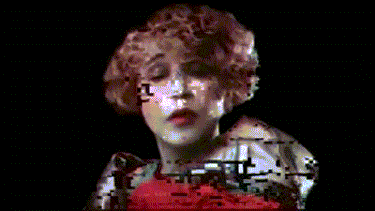
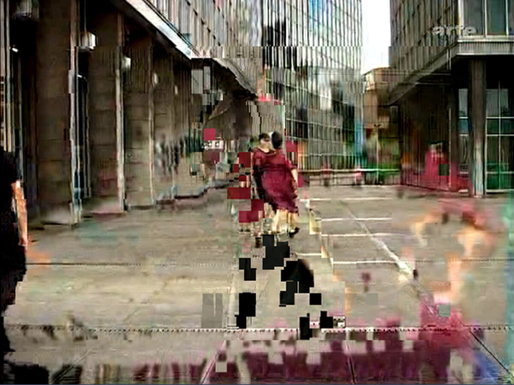
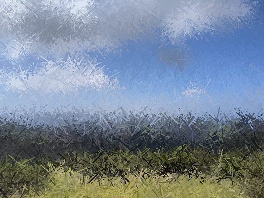
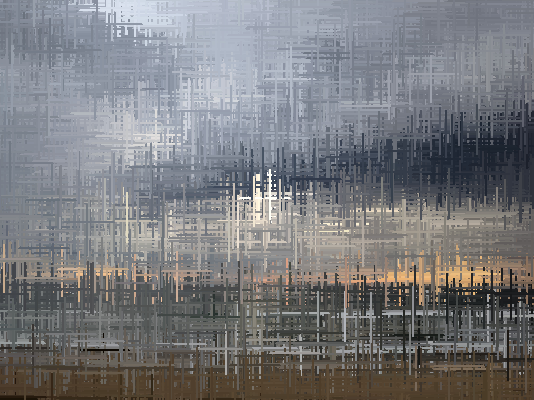

# Week 8 Quiz  
Course: IDEA9103 – Week 8 Imaging & Coding Techniques

## Part 1: Imaging Technique Inspiration  
### Inspiration: **Glitch Portrait Art**

My inspiration comes from glitch art, which deliberately distorts digital images through errors, pixel movement and color channel misalignment.  This aesthetic redefines "error" as an expressive element, exploring themes of memory, data corruption and reconstruction.  This method transforms classical portraits into contemporary and fragmented elements.

**Images：**

## Part 2: Coding Technique Exploration  
### Technique: **Glitch Lines**

Drawing on the HappyCoding Glitch Lines tutorial, I will incorporate this technique in p5.js:
- **Random Fault Line superposition**: Following the idea of HappyCoding, randomly select the image position "(x, y)" and sample the pixel color with "img". Get (x, y) ', and then draw a short line (horizontal, vertical or diagonal) with this color. These lines act as visual cracks or distortions on the portrait.

**Images showcasing the coding technique**

**A link to an example implementation**
[Glitch Lines](https://happycoding.io/tutorials/processing/images/glitch-lines)